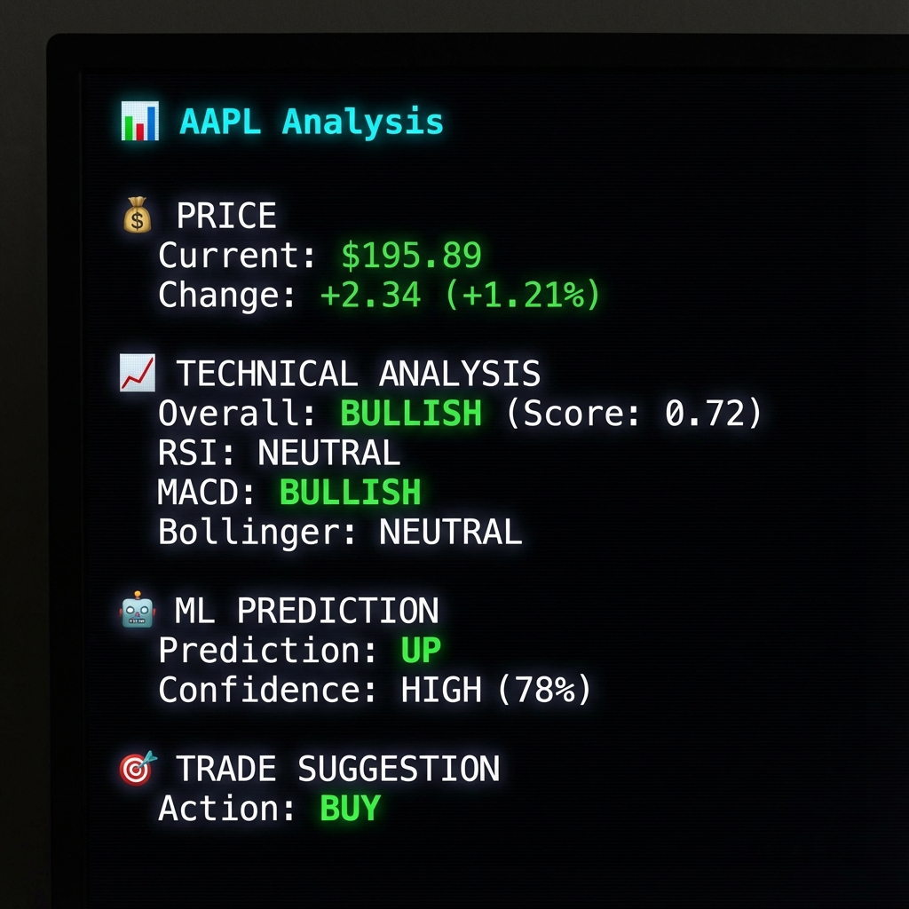
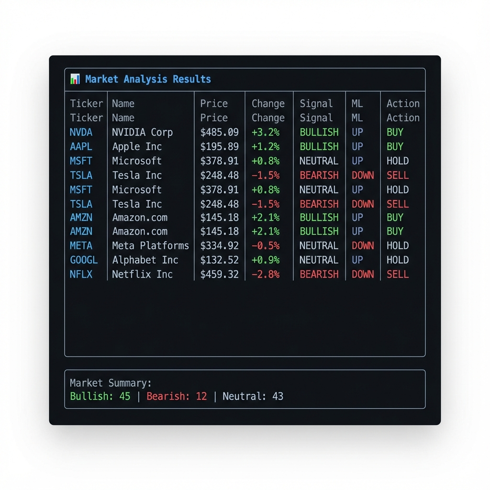
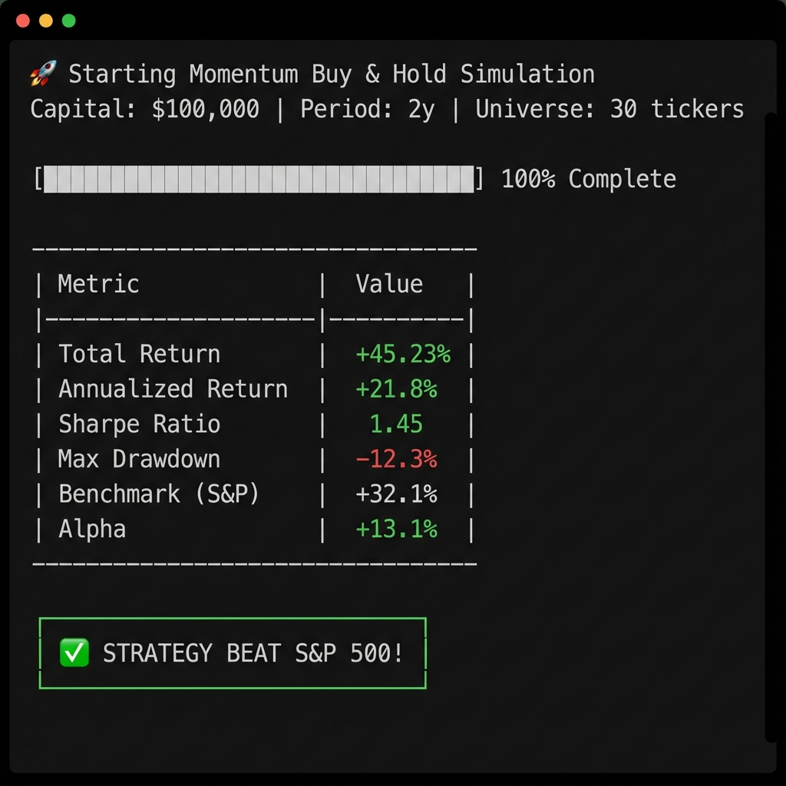

# 📊 Stock Market Trader

A comprehensive Python CLI tool for stock market analysis, prediction, and automated trading simulation. Features technical analysis with 15+ indicators, XGBoost ML predictions, momentum strategies, backtesting, and live paper trading with email notifications.


## ✨ Features

- **Technical Analysis** - RSI, MACD, Bollinger Bands, ADX, Stochastic, and many more
- **ML Predictions** - XGBoost models with SHAP explanations
- **Momentum Strategy** - Beat the S&P 500 with smart stock selection
- **Live Trading Simulation** - Paper trading with scheduled execution
- **Market Scanner** - Scan top 100 tickers for opportunities
- **Backtesting** - Validate strategies with historical data
- **Email Notifications** - Get trading updates via email
- **Docker Ready** - Deploy on Raspberry Pi or any server
- **Rich TUI** - Beautiful terminal interface (React Ink)

## � Screenshots

### Stock Analysis



### Market Scanner



### Trading Simulation



## �🚀 Quick Start

### Installation

```bash
# Clone the repository
git clone https://github.com/your-username/stock-market.git
cd stock-market

# Create virtual environment
python -m venv venv
source venv/bin/activate  # Linux/Mac
# or: venv\Scripts\activate  # Windows

# Install dependencies
pip install -r requirements.txt
```

### Basic Usage

```bash
# Analyze a single stock
python -m src.main analyze AAPL

# Quick market scan (top 20 stocks)
python -m src.main scan --quick

# Full market scan (top 100 stocks)
python -m src.main scan

# Backtest a strategy
python -m src.main backtest TSLA --period 2y
```

## 📖 Commands

### `analyze <TICKER>`

Deep analysis of a single stock with technical indicators and ML predictions.

```bash
python -m src.main analyze AAPL --period 1y
python -m src.main analyze MSFT --json  # JSON output
```

### `scan`

Scan multiple stocks for trading opportunities.

```bash
python -m src.main scan --quick          # Top 20 stocks
python -m src.main scan --limit 50       # Custom limit
python -m src.main scan --period 6mo     # Different period
```

### `backtest <TICKER>`

Run backtesting on historical data to validate trading strategies.

```bash
python -m src.main backtest TSLA --period 2y --capital 100000
```

### `simulate`

Run full trading simulation with momentum strategy.

```bash
python -m src.main simulate --capital 100000 --period 2y --tickers 30
python -m src.main simulate --json  # JSON output
```

### `longrun`

Live paper trading simulation designed for scheduled execution.

```bash
# Initialize with capital
python -m src.main longrun --init 10000

# Check portfolio status
python -m src.main longrun --status

# Run trading cycle (dry run)
python -m src.main longrun

# Execute trades + send email
python -m src.main longrun --execute --email
```

## 🛠 Configuration

Copy `.env.example` to `.env` and configure:

```bash
cp .env.example .env
```

### Environment Variables

| Variable | Description |
|----------|-------------|
| `FINNHUB_API_KEY` | Your Finnhub API key ([get one free](https://finnhub.io/)) |
| `LONGRUN_STATE_FILE` | Path to portfolio state file |
| `SMTP_HOST` | SMTP server (default: smtp.gmail.com) |
| `SMTP_PORT` | SMTP port (default: 587) |
| `SMTP_USER` | Email username |
| `SMTP_PASSWORD` | Email password (use App Password for Gmail) |
| `EMAIL_FROM` | Sender email address |
| `EMAIL_TO` | Recipient email address |

## 🐳 Docker Deployment

Deploy on a server or Raspberry Pi for automated trading:

```bash
# Build and run
docker-compose up -d

# View logs
docker-compose logs -f trader

# Initialize portfolio
docker-compose exec trader python -m src.main longrun --init 10000
```

The scheduler runs every 2 hours during market hours (9:30, 11:30, 13:30, 15:30 EST).

## 📁 Project Structure

```
stock-market/
├── src/
│   ├── main.py              # CLI entry point
│   ├── api.py               # API for TUI
│   ├── data_fetcher.py      # Yahoo Finance data
│   ├── finnhub_client.py    # Finnhub integration
│   ├── indicators.py        # Technical indicators
│   ├── predictor.py         # XGBoost ML models
│   ├── enhanced_predictor.py # Advanced ML features
│   ├── scanner.py           # Market scanner
│   ├── backtester.py        # Strategy backtesting
│   ├── simulator.py         # Trading simulation
│   ├── enhanced_simulator.py # Advanced simulator
│   ├── momentum_strategy.py # Momentum strategy
│   ├── live_trader.py       # Live paper trading
│   └── email_notifier.py    # Email notifications
├── tui/                     # React Ink terminal UI
├── tests/                   # Test suite
├── data/                    # State persistence
├── docker-compose.yml       # Docker orchestration
├── Dockerfile              # Container image
├── requirements.txt        # Python dependencies
└── run.sh                  # Launch script
```

## 🖥️ Terminal UI (TUI)

A beautiful React Ink-based terminal interface:

```bash
# Install TUI dependencies
cd tui && npm install

# Run TUI
./run.sh tui
```

## 📊 Technical Indicators

The analysis includes:

- **Trend**: SMA, EMA, MACD, ADX
- **Momentum**: RSI, Stochastic, Williams %R, CCI
- **Volatility**: Bollinger Bands, ATR
- **Volume**: OBV, Volume MA
- **Support/Resistance**: Historical levels

## 🤖 Machine Learning

- **Model**: XGBoost Classifier
- **Features**: 50+ technical and price-based features
- **Target**: 5-day forward return direction
- **Explainability**: SHAP values for prediction explanations

## 📈 Trading Strategies

### Momentum Strategy

- Scores stocks by momentum factors
- Invests equally in top 10 performers
- Monthly rebalancing
- Historically beats S&P 500 in bull markets

### Active Trading

- Uses ML predictions + technical signals
- Dynamic position sizing
- Stop-loss and take-profit management
- Trailing stop optimization

## 🧪 Testing

```bash
pytest tests/
```

## 📄 License

MIT License - see [LICENSE](LICENSE) for details.

## ⚠️ Disclaimer

This software is for educational and simulation purposes only. It does not execute real trades. Past performance does not guarantee future results. Always do your own research before making investment decisions.
